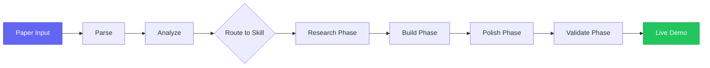
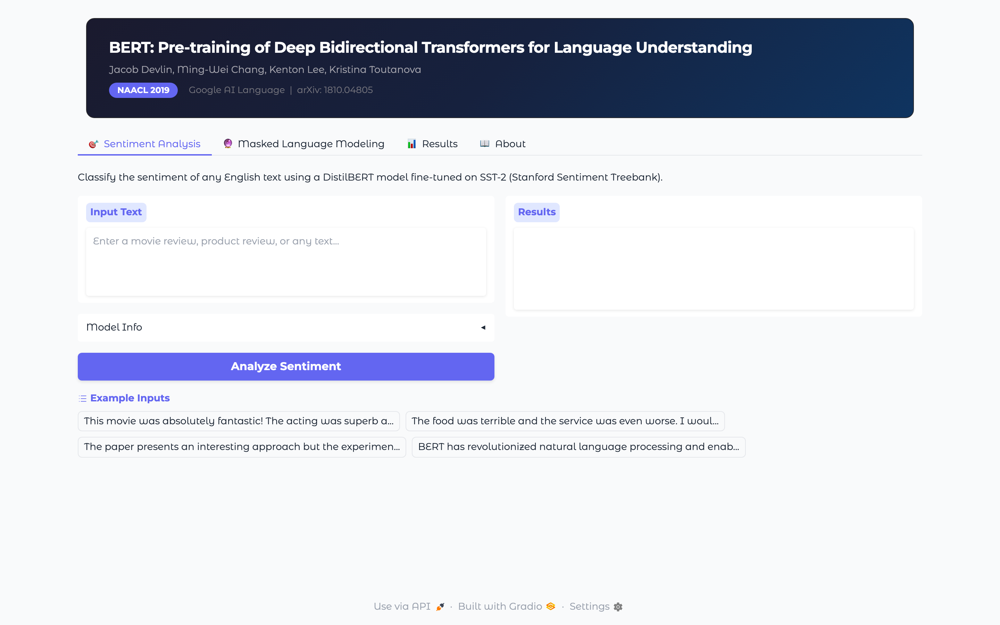
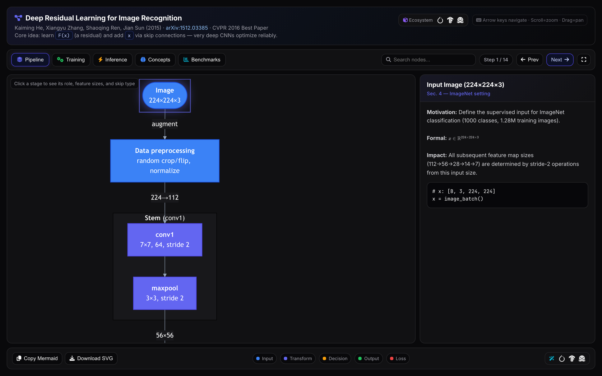
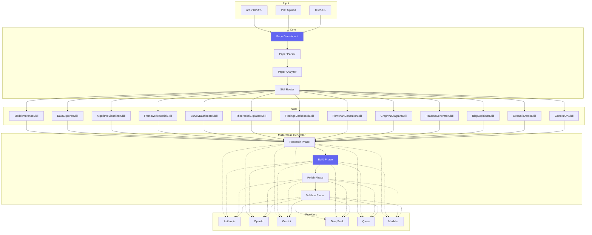

<div align="center">

# Paper Demo Agent

**Turn any scientific paper into a live interactive demo — with one command.**

[](https://pypi.org/project/paper-demo-agent/)
[](https://www.python.org/)
[](LICENSE)
[](https://pypi.org/project/paper-demo-agent/)

<!-- TODO: Replace with actual terminal recording (VHS/Terminalizer) -->
<!--  -->

[Quick Start](#quick-start) · [Features](#features) · [Output Formats](#output-formats) · [Providers](#supported-providers) · [CLI Reference](#cli-reference) · [Python API](#python-api)

</div>

---

## Quick Start

```bash
pip install paper-demo-agent
paper-demo-agent key set ANTHROPIC_API_KEY sk-ant-...
paper-demo-agent demo 1706.03762
```

Or launch the web UI:

```bash
paper-demo-agent ui
# → Opens http://localhost:7860
```

No `pip` needed (with pipx):

```bash
pipx run paper-demo-agent ui
```

---

## Features

| | Feature | Description |
|---|---|---|
| 🧠 | **Smart Routing** | AI reads the paper and picks the best demo type — model inference, data explorer, slides, diagram, and more |
| 📦 | **10 Output Formats** | Gradio apps, Streamlit dashboards, reveal.js slides, PowerPoint, LaTeX/Beamer, project pages, blog articles, READMEs, Mermaid flowcharts, Graphviz diagrams |
| 🤖 | **Multi-Phase Agent** | 4-phase pipeline (Research → Build → Polish → Validate) with tool use, web search, and self-correction |
| 🔌 | **6 LLM Providers** | Anthropic, OpenAI, Google Gemini, DeepSeek, Qwen, MiniMax — switch with one flag |
| 🔑 | **Zero-Config Auth** | Auto-detects keys from Claude Code, OpenAI Codex CLI, Aider, gcloud ADC, and environment variables |
| 📄 | **Any Input** | arXiv ID, arXiv URL, any URL, local PDF, or raw text |
| 🌐 | **Web UI** | Dark-themed Gradio interface with real-time progress streaming, phase stepper, file preview, and one-click demo launch |
| ⚡ | **One Command** | `paper-demo-agent demo 1706.03762` — that's it |

---

## How It Works



1. **Parse** — Fetches the paper from arXiv, URL, or local PDF. Extracts title, abstract, full text, and figures.
2. **Analyze** — AI classifies the paper type (model, dataset, algorithm, framework, survey, theory, empirical) and recommends the best output format.
3. **Route** — Maps paper type + user preferences to one of 15 specialized skills.
4. **Research** — Searches the web for paper-specific information (results, benchmarks, figures) — not library docs (those are pre-baked in the skill prompts).
5. **Build** — Multi-iteration code generation with 7 tools (write_file, read_file, list_files, web_search, run_python, extract_pdf_page, execute_command).
6. **Polish** — Quality review pass with skill-specific checklists.
7. **Validate** — Form-compliance check ensures the output matches the requested format, with auto-correction if needed.

---

## Output Formats

### Apps

| Format | Technology | Best For |
|---|---|---|
| **Gradio App** | Gradio 5 (Python) | Model inference, interactive demos, HuggingFace Spaces |
| **Streamlit App** | Streamlit (Python) | Data dashboards, exploration tools, widgets |

### Presentations

| Format | Technology | Best For |
|---|---|---|
| **HTML Slides** | reveal.js 5.2.1 | Animated talks with KaTeX math and speaker notes |
| **PowerPoint** | python-pptx 1.0.0 | Conference presentations, offline sharing |
| **LaTeX / Beamer** | Beamer + Metropolis | Academic talks with TikZ diagrams and booktabs |

### Pages

| Format | Technology | Best For |
|---|---|---|
| **Project Page** | HTML/CSS/JS | Nerfies/Distill.pub-style research landing pages |
| **Blog Article** | HTML + D3.js + KaTeX | Interactive explainers with visualizations |
| **GitHub README** | Markdown + Mermaid | Publication-quality README with badges and diagrams |

### Diagrams

| Format | Technology | Best For |
|---|---|---|
| **Mermaid Flowchart** | Mermaid.js v11 (ESM) | Interactive architecture diagrams, step-by-step walkthroughs |
| **Graphviz Diagram** | Python graphviz | Publication-quality SVG/PNG architecture diagrams |

<!-- TODO: Add output screenshots
### Gallery

| Gradio App | reveal.js Slides | Project Page | Mermaid Diagram |
|---|---|---|---|
|  |  |  |  |
-->

---

## Supported Providers

| Provider | Default Model | Env Variable | Notes |
|---|---|---|---|
| **Anthropic** | `claude-sonnet-4-6` | `ANTHROPIC_API_KEY` | Best quality. Auto-detected from Claude Code |
| **OpenAI** | `gpt-5.2` | `OPENAI_API_KEY` | Also supports o3, o4-mini. Auto-detected from Codex CLI |
| **Gemini** | `gemini-2.5-flash` | `GOOGLE_API_KEY` | Also supports gcloud ADC (no key needed) |
| **DeepSeek** | `deepseek-chat` | `DEEPSEEK_API_KEY` | Also supports deepseek-reasoner |
| **Qwen** | `qwen-max` | `QWEN_API_KEY` | Also supports qwen-plus, qwen-turbo |
| **MiniMax** | `abab6.5-chat` | `MINIMAX_API_KEY` | Also requires `MINIMAX_GROUP_ID` |

### Zero-Config Authentication

Paper Demo Agent automatically detects API keys from tools you already use:

| Tool | Config Path | Provides |
|---|---|---|
| **Claude Code** | `~/.claude/.credentials.json` | `ANTHROPIC_API_KEY` |
| **OpenAI Codex CLI** | `~/.codex/auth.json` | `OPENAI_API_KEY` |
| **Aider** | `~/.aider.conf.yml` | `ANTHROPIC_API_KEY`, `OPENAI_API_KEY` |
| **gcloud ADC** | `~/.config/gcloud/application_default_credentials.json` | Gemini auth |

If you use any of these tools, Paper Demo Agent works immediately — no key setup required.

---

## CLI Reference

```bash
# Generate a demo (AI picks the best format)
paper-demo-agent demo 1706.03762

# Specify provider and model
paper-demo-agent demo arxiv:1706.03762 \
    --provider anthropic \
    --model claude-opus-4-6

# Specify output format
paper-demo-agent demo 1706.03762 --form presentation
paper-demo-agent demo 1706.03762 --form app --subtype streamlit
paper-demo-agent demo 1706.03762 --form presentation --subtype beamer
paper-demo-agent demo 1706.03762 --form page --subtype readme
paper-demo-agent demo 1706.03762 --form diagram --subtype graphviz

# From a local PDF
paper-demo-agent demo paper.pdf --provider openai

# Custom output directory
paper-demo-agent demo 1706.03762 --output ./my-demo

# Launch the web UI
paper-demo-agent ui
paper-demo-agent ui --port 8080 --share

# Manage API keys
paper-demo-agent key set ANTHROPIC_API_KEY sk-ant-...
paper-demo-agent key set OPENAI_API_KEY sk-...
paper-demo-agent key list

# List available providers
paper-demo-agent providers

# HuggingFace (for gated models)
paper-demo-agent login   # Browser-based HF login
paper-demo-agent logout
```

---

## Python API

```python
from paper_demo_agent import PaperDemoAgent

agent = PaperDemoAgent(provider="anthropic")

# Full pipeline: parse → analyze → generate
result = agent.run(
    source="1706.03762",
    demo_form="app",           # or: presentation, slides, latex, website, flowchart, ...
    demo_type="user_demo",     # or: findings, theoretical
    on_progress=print,
)

print(f"Output:  {result.output_dir}")
print(f"Main:    {result.main_file}")
print(f"Run:     {result.run_command}")
```

### Step-by-Step

```python
# Parse only
paper = agent.parse("1706.03762")
print(f"Title: {paper.title}")
print(f"Abstract: {paper.abstract[:200]}...")

# Analyze
analysis = agent.analyze(paper)
print(f"Paper type: {analysis.paper_type}")
print(f"Recommended form: {analysis.demo_form}")
print(f"Recommended type: {analysis.demo_type}")
```

---

## Architecture



## Project Structure

```
paper_demo_agent/
├── agent.py              # Main orchestrator (parse → analyze → route → generate)
├── config.py             # ~/.paper-demo-agent/config.json key storage
├── cli.py                # CLI entry point (click)
├── ui/app.py             # Gradio web interface
├── providers/            # LLM providers (Anthropic, OpenAI, Gemini, DeepSeek, Qwen, MiniMax)
├── paper/                # Paper parsing (arXiv API, PDF extraction, URL fetching)
├── analysis/             # Paper classification + routing
├── skills/               # 15 specialized demo generation skills
│   ├── model_inference.py
│   ├── data_explorer.py
│   ├── algorithm_visualizer.py
│   ├── framework_tutorial.py
│   ├── survey_dashboard.py
│   ├── theoretical_explainer.py
│   ├── findings_dashboard.py
│   ├── flowchart_generator.py
│   ├── graphviz_diagram.py
│   ├── readme_generator.py
│   ├── blog_explainer.py
│   ├── streamlit_demo.py
│   ├── general_qa.py
│   └── ...
└── generation/           # Multi-phase generator + tool definitions
    ├── generator.py      # 4-phase pipeline (Research → Build → Polish → Validate)
    ├── tools.py          # 7 agent tools (write_file, read_file, web_search, ...)
    └── runner.py         # Demo launcher (open in browser / run app server)
```

---

## Development

```bash
git clone https://github.com/paper-demo-agent/paper-demo-agent
cd paper-demo-agent
pip install -e ".[dev]"
pytest tests/
```

## Contributing

Contributions are welcome! Please open an issue or PR.

- **Bug reports** — include the arXiv ID and provider used
- **New skills** — subclass `BaseSkill` and register in the router
- **New providers** — subclass `BaseLLMProvider` and add to `factory.py`

---

## License

MIT — see [LICENSE](LICENSE)

---

<div align="center">

**If Paper Demo Agent saved you time, give it a star!**

[](https://github.com/paper-demo-agent/paper-demo-agent)

</div>
